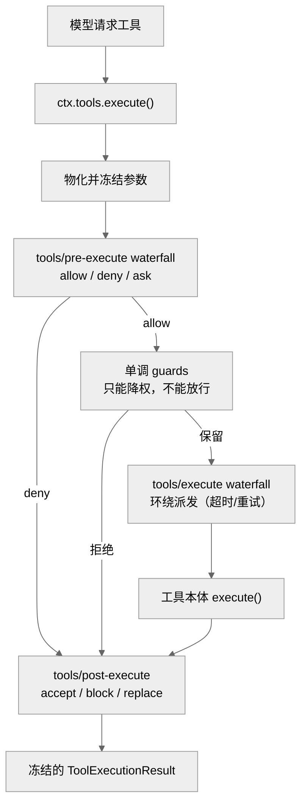
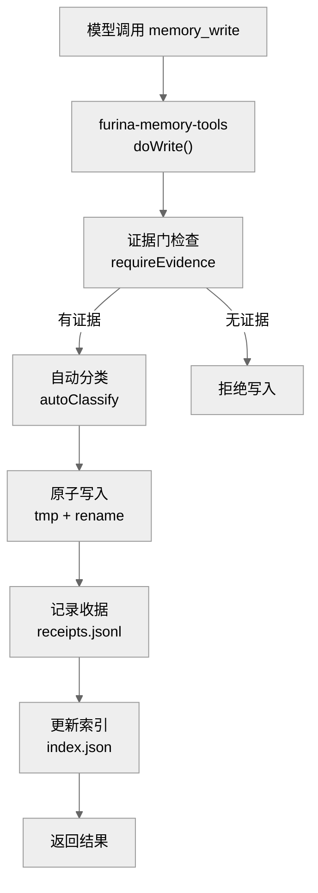
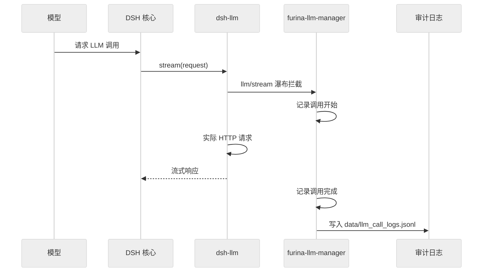
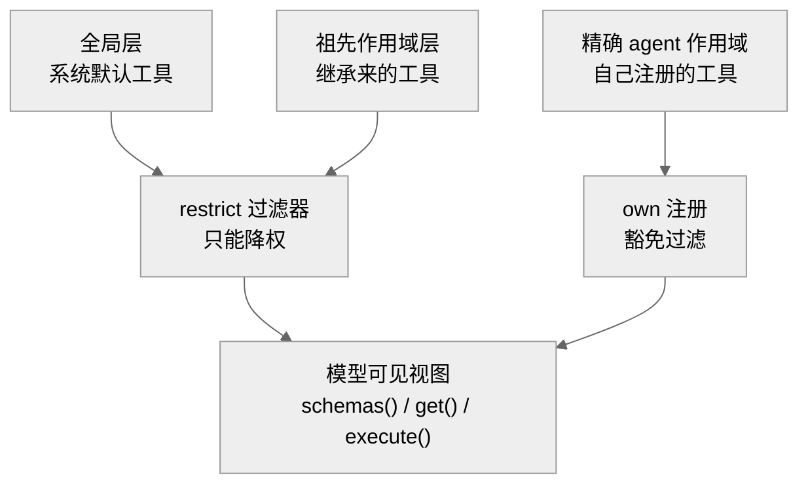
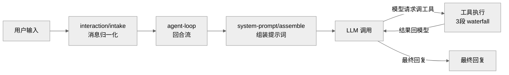

# Furina DSH Plugins - 轨迹可视化

## 1. 工具执行轨迹 - DSH 标准管线

展示模型调一个工具时，请求穿过哪些关卡：

```mermaid
%%{init: {"theme": "neutral"}}%%
flowchart TD
  M["模型请求工具"]
  R["ctx.tools.execute()"]
  F["物化并冻结参数"]
  P["tools/pre-execute waterfall\nallow / deny / ask"]
  G["单调 guards\n只能降权，不能放行"]
  E["tools/execute waterfall\n环绕派发（超时/重试）"]
  B["工具本体 execute()"]
  PO["tools/post-execute\naccept / block / replace"]
  RES["冻结的 ToolExecutionResult"]
  
  M --> R
  R --> F
  F --> P
  P -->|allow| G
  P -->|deny| PO
  G -->|保留| E
  G -->|拒绝| PO
  E --> B
  B --> PO
  PO --> RES
```

## 2. Furina 记忆工具轨迹

```mermaid
%%{init: {"theme": "neutral"}}%%
flowchart TD
  M["模型调用 memory_write"]
  T["furina-memory-tools\ndoWrite()"]
  E["证据门检查\nrequireEvidence"]
  C["自动分类\nautoClassify"]
  W["原子写入\ntmp + rename"]
  R["记录收据\nreceipts.jsonl"]
  I["更新索引\nindex.json"]
  RET["返回结果"]
  
  M --> T
  T --> E
  E -->|无证据| ERR["拒绝写入"]
  E -->|有证据| C
  C --> W
  W --> R
  R --> I
  I --> RET
```

## 3. LLM 审计轨迹

```mermaid
%%{init: {"theme": "neutral"}}%%
sequenceDiagram
  participant Model as 模型
  participant DSH as DSH 核心
  participant LLM as dsh-llm
  participant Audit as furina-llm-manager
  participant Log as 审计日志
  
  Model->>DSH: 请求 LLM 调用
  DSH->>LLM: stream(request)
  LLM->>Audit: llm/stream 瀑布拦截
  Audit->>Audit: 记录调用开始
  LLM->>LLM: 实际 HTTP 请求
  LLM-->>DSH: 流式响应
  Audit->>Audit: 记录调用完成
  Audit->>Log: 写入 data/llm_call_logs.jsonl
```

## 4. 插件注册与作用域遮蔽

```mermaid
%%{init: {"theme": "neutral"}}%%
flowchart TD
  GLOBAL["全局层\n系统默认工具"]
  ANCESTOR["祖先作用域层\n继承来的工具"]
  AGENT["精确 agent 作用域\n自己注册的工具"]
  RESTRICT["restrict 过滤器\n只能降权"]
  OWN["own 注册\n豁免过滤"]
  VISIBLE["模型可见视图\nschemas() / get() / execute()"]
  
  GLOBAL --> RESTRICT
  ANCESTOR --> RESTRICT
  AGENT --> OWN
  RESTRICT --> VISIBLE
  OWN --> VISIBLE
```

## 5. 完整请求生命周期

```mermaid
%%{init: {"theme": "neutral"}}%%
flowchart LR
  U["用户输入"]
  IN["interaction/intake\n消息归一化"]
  LOOP["agent-loop\n回合流"]
  SP["system-prompt/assemble\n组装提示词"]
  LLM["LLM 调用"]
  TOOL["工具执行\n3段 waterfall"]
  RES["最终回复"]
  
  U --> IN
  IN --> LOOP
  LOOP --> SP
  SP --> LLM
  LLM -->|模型请求调工具| TOOL
  TOOL -->|结果回模型| LLM
  LLM -->|最终回复| RES
```
